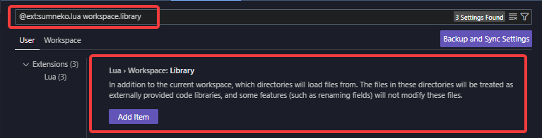
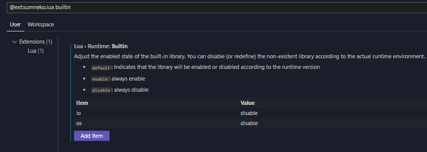

# CC:Tweaked VSCode Workspace
 A typed workspace for CC:Tweaked ~~and Plethora~~.

## How To Use
You will need the [Lua Language Server VS Code extension by sumneko](https://marketplace.visualstudio.com/items?itemName=sumneko.lua) for this workspace to work.

Once you download the workspace you will need to go into the extension's settings and add the path into `workspace.library`.

It is also recommended that you disable the built-in `io` and `os` globals.
