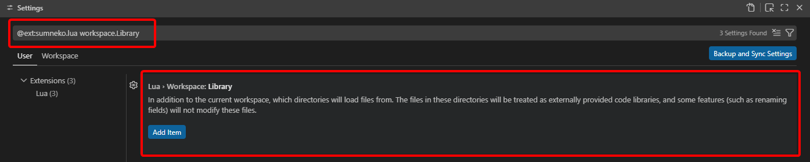
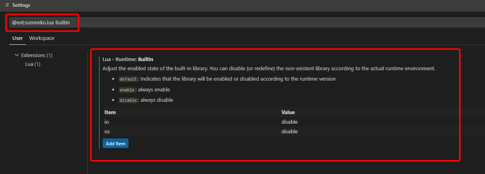

# CC:Tweaked VSCode Workspace
 A [LuaCATS](https://luals.github.io/wiki/annotations/) typed workspace for [`CC:Tweaked`](https://github.com/cc-tweaked/CC-Tweaked), as well as some integrations for [`Advanced Peripherals`](https://github.com/IntelligenceModding/AdvancedPeripherals), [`Create`](https://github.com/Creators-of-Create/Create), and [`Tom's Peripherals`](https://github.com/tom5454/Toms-Peripherals).

## How To Install
You will need the [Lua Language Server VS Code extension by sumneko](https://marketplace.visualstudio.com/items?itemName=sumneko.lua) for this workspace to work.


Once you download the workspace you will need to go into the extension's settings and add the path into `workspace.library`. Copy and pastable settings path for your leisure: `@ext:sumneko.lua workspace.Library`



It is also recommended that you disable the built-in `io` and `os` globals that come with the extension, as `CC:Tweaked` adds it's own methods for these libraries. Copy and pastable settings path for your leisure: `@ext:sumneko.lua Builtin`



### Type Annotations
You can specify type annotations for things explicitly by using LuaCATS. This is especially useful when wrapping peripherals:
```lua
local monitor = peripheral.wrap("top") ---@type cc.peripheral.Monitor
monitor.setTextScale(4)
monitor.write("Hello world!")
```